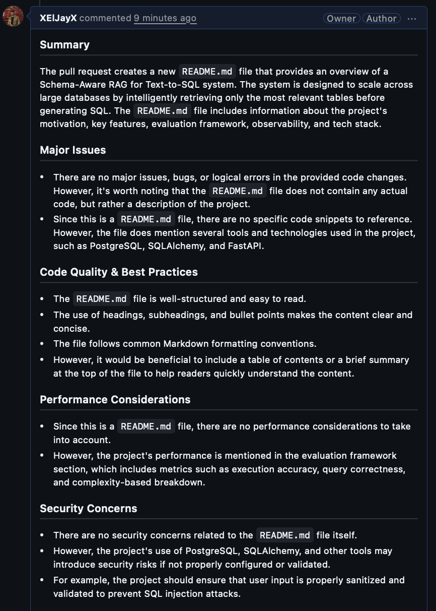
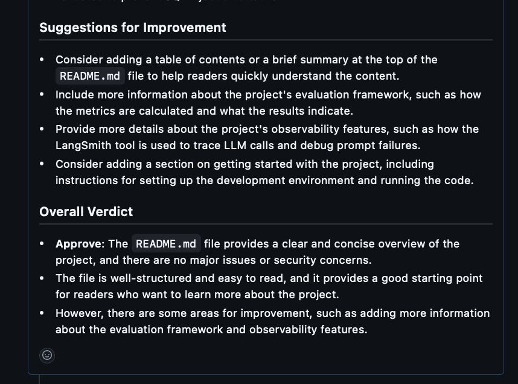

# 🤖 AutoReviewer — Autonomous AI Code Review Agent

> An autonomous AI agent that automatically reviews GitHub Pull Requests for security vulnerabilities, bad coding practices, and performance issues — and posts structured feedback as a comment, without any human intervention.

**Live Demo:** [prcodereviewer-production.up.railway.app](https://prcodereviewer-production.up.railway.app)




---

## 🧠 What It Doess

When a developer opens a Pull Request:

1. **GitHub fires a webhook** to the AutoReviewer server
2. **FastAPI receives it instantly** — verifies the request signature and queues the job
3. **Celery picks up the job** asynchronously in the background
4. **LangGraph agent runs** — fetches the PR diff, sends it to an LLM, generates a structured review
5. **Review is posted** back to the GitHub PR as a comment automatically

No manual intervention. No clicking. It just works.

---

## 🏗️ Architecture

```
GitHub PR Opened
      │
      ▼
┌─────────────────────────────┐
│   FastAPI Webhook Server    │  ← verifies HMAC signature
│   (Railway - always on)     │  ← returns 200 instantly
└────────────┬────────────────┘
             │ queues job
             ▼
┌─────────────────────────────┐
│        Redis Broker         │  ← holds jobs in queue
│   (Railway managed Redis)   │
└────────────┬────────────────┘
             │ picks up job
             ▼
┌─────────────────────────────┐
│      Celery Worker          │  ← runs agent asynchronously
│   (Railway - always on)     │
└────────────┬────────────────┘
             │
             ▼
┌─────────────────────────────────────────────┐
│           LangGraph Agent                   │
│                                             │
│  [fetch_pr] → [analyze_code] → [post_comment] │
│                                             │
│  • Fetches PR diff via GitHub API           │
│  • Sends to Groq LLaMA 3.3 70B for review  │
│  • Posts structured review to GitHub PR    │
└─────────────────────────────────────────────┘
```

---

## 🛠️ Tech Stack

| Layer | Technology | Purpose |
|---|---|---|
| Agent Framework | LangGraph | Stateful multi-node agent pipeline |
| LLM | Groq (LLaMA 3.3 70B) | Code analysis and review generation |
| Backend | FastAPI | Async webhook server |
| Task Queue | Celery + Redis | Async background job processing |
| GitHub Integration | PyGitHub + httpx | PR fetching and comment posting |
| Security | HMAC-SHA256 | Webhook signature verification |
| Deployment | Railway | Cloud hosting (web + worker + Redis) |
| Config | Pydantic Settings | Type-safe environment management |

---

## 🔍 Code Review Output

The agent reviews every PR across 7 categories:

1. **Summary** — what the PR does
2. **Major Issues** — bugs, logic errors, breaking changes
3. **Code Quality** — naming, structure, readability
4. **Performance** — inefficient algorithms, unnecessary computation
5. **Security Concerns** — injection risks, improper validation
6. **Suggestions** — concrete recommendations with examples
7. **Overall Verdict** — Approve / Request Changes / Comment Only

---

## 🚀 Getting Started

### Prerequisites
- Python 3.11+
- Redis running locally
- GitHub account + personal access token
- Groq API key (free at [console.groq.com](https://console.groq.com))

### Local Setup

```bash
# Clone the repo
git clone https://github.com/XElJayX/autoreviewer.git
cd autoreviewer

# Create and activate virtual environment
python -m venv venv
source venv/bin/activate  # Windows: venv\Scripts\activate

# Install dependencies
pip install -r requirements.txt

# Set up environment variables
cp .env.example .env
# Fill in your API keys in .env
```

### Environment Variables

```bash
GROQ_API_KEY=your_groq_api_key
GITHUB_TOKEN=your_github_token
WEBHOOK_SECRET=your_webhook_secret
REDIS_URL=redis://localhost:6379/0
LANGCHAIN_TRACING_V2=true
LANGCHAIN_API_KEY=your_langsmith_key
LANGCHAIN_PROJECT=autoreviewer
```

### Running Locally

```bash
# Terminal 1 - FastAPI server
uvicorn app.main:app --reload --port 8000

# Terminal 2 - Celery worker
celery -A app.worker.celery_app worker --loglevel=info --concurrency=1

# Terminal 3 - Expose locally with ngrok
ngrok http 8000
```

Then add your ngrok URL as a GitHub webhook on your repo with `application/json` content type and Pull Request events.

---

## 📁 Project Structure

```
autoreviewer/
├── app/
│   ├── agent/
│   │   ├── graph.py        ← LangGraph agent (3 nodes)
│   │   └── state.py        ← TypedDict state definition
│   ├── api/
│   │   └── webhook.py      ← FastAPI webhook endpoint
│   ├── tools/
│   │   └── github_tool.py  ← GitHub API integration
│   ├── config.py           ← Pydantic settings with caching
│   ├── main.py             ← FastAPI app entry point
│   └── worker.py           ← Celery app and tasks
├── tests/
│   ├── test_github_tool.py
│   └── test_agent.py
├── Procfile
├── railway.toml
├── requirements.txt
└── README.md
```

---

## 🔐 Security

- All incoming webhooks are verified using **HMAC-SHA256 signature validation**
- GitHub token and API keys are stored as environment variables — never hardcoded
- `hmac.compare_digest` is used to prevent timing attacks

---

## 🧩 Challenges & Learnings

**Deployment memory constraints** — Railway's free tier has 512MB RAM. The default Celery worker spawns 32 processes which immediately crashed the service. Fixed by setting `--concurrency=1` to run a single worker process, reducing memory usage by ~95%.

**Async webhook handling** — GitHub expects a response within 10 seconds. Since the LLM call alone takes 3-5 seconds, running the agent synchronously inside the webhook handler risked timeouts. Solved by immediately queuing the job with Celery and returning `{"status": "queued"}` to GitHub before the agent runs.

**Webhook security** — Without signature verification, anyone could send fake PR events and trigger the agent. Implemented HMAC-SHA256 verification using the shared webhook secret to ensure only genuine GitHub requests are processed.

---

## 🗺️ Roadmap

- [ ] Add pytest test suite for all nodes and tools
- [ ] LangSmith observability integration
- [ ] Support for multiple LLM providers
- [ ] Skip review for documentation-only PRs
- [ ] Retry logic for failed Celery tasks
- [ ] Review summary dashboard

---

## 👨‍💻 Author

**Jayanth** — [@XElJayX](https://github.com/XElJayX)

---

## 📄 License

MIT License — feel free to use, modify, and distribute.